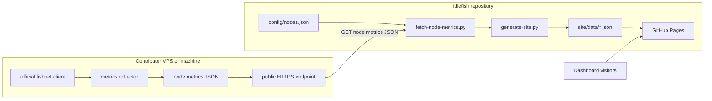
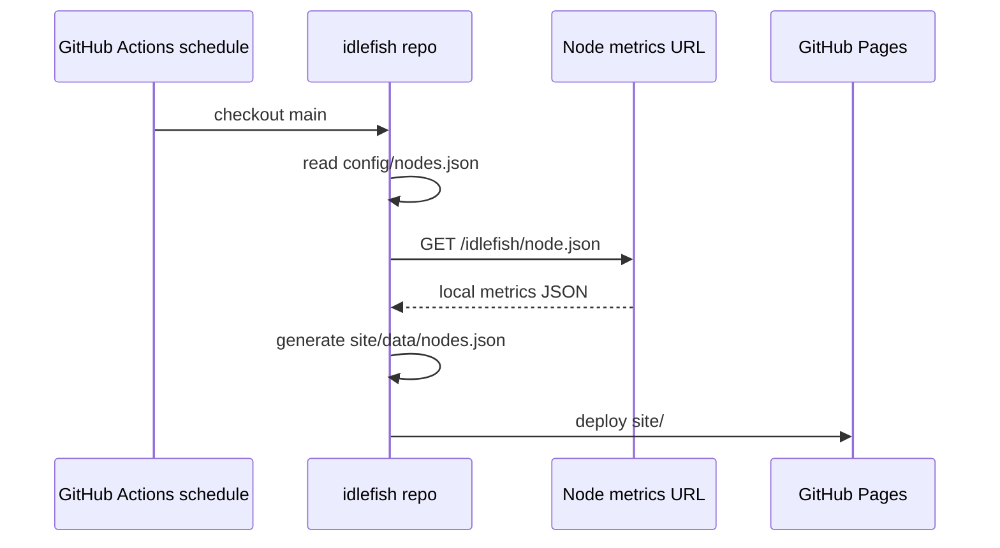
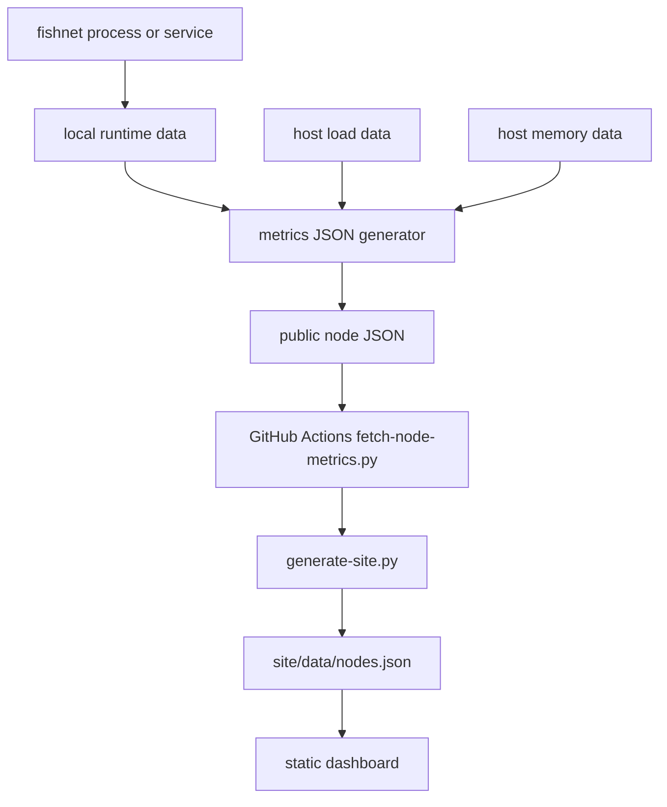

# v0 architecture

`idlefish` v0 is a static dashboard with pull-based metrics collection.

Contributing machines do not push to GitHub. Each node publishes one small read-only JSON file. A scheduled GitHub Actions job fetches those files, rebuilds the dashboard data, and publishes GitHub Pages.

The architecture depends on a simple contract: each node has a public HTTPS URL that returns local metrics JSON. How a contributor creates and serves that JSON is up to them.

## System overview

## Scheduled dashboard build

## Node responsibility

Each node is responsible for:

- running the official fishnet client
- keeping its fishnet key local and private
- collecting local metrics periodically, using the included script or an equivalent local method
- publishing one public JSON file over HTTPS, using Caddy or any other suitable web setup
- choosing a pseudonymous node name if privacy matters

The node does not need:

- GitHub push access
- a GitHub token
- access to other nodes
- access to private Lichess data

## Repository responsibility

The central repository is responsible for:

- listing approved public metrics URLs in `config/nodes.json`
- fetching each node's JSON file on a schedule
- generating static dashboard data
- publishing the GitHub Pages site

## Data flow

## Why this shape

The pull model keeps contribution simple and conservative:

- contributors only expose read-only local metrics
- maintainers control which URLs are included
- the dashboard can be rebuilt without secrets
- GitHub Pages remains static
- failed or missing nodes degrade into dashboard fetch errors instead of breaking the build

This leaves room for different node environments. A common VPS might use systemd timers and Caddy. Another machine might use cron and nginx. A homelab host might generate the JSON from an existing monitoring stack. As long as the public URL returns the agreed JSON fields, the central dashboard does not care.

## What v0 does not do

v0 does not provide authentication for node metrics URLs. The metrics are intentionally public and low sensitivity. If a node operator is not comfortable publishing the fields collected by `collect-local-metrics.sh`, they should not list that node publicly.

v0 also does not store long-term history. The dashboard shows the latest fetched state. Historical storage can be added later with Prometheus, Grafana, or another time-series backend if the project needs it.
